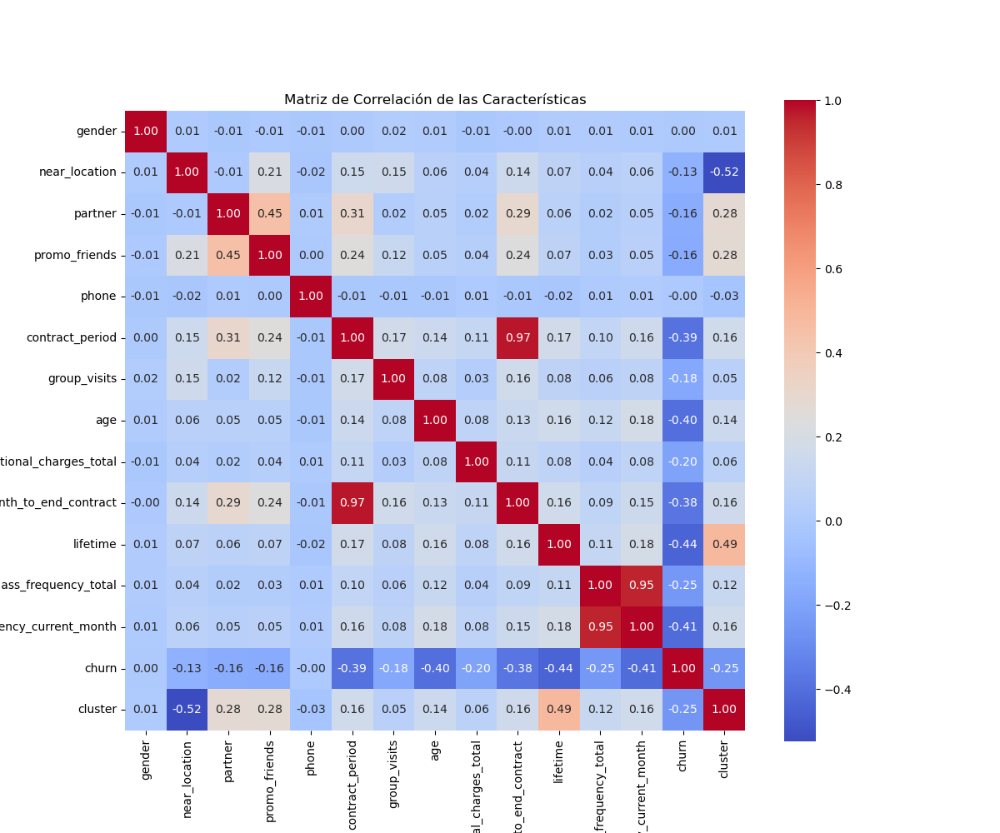
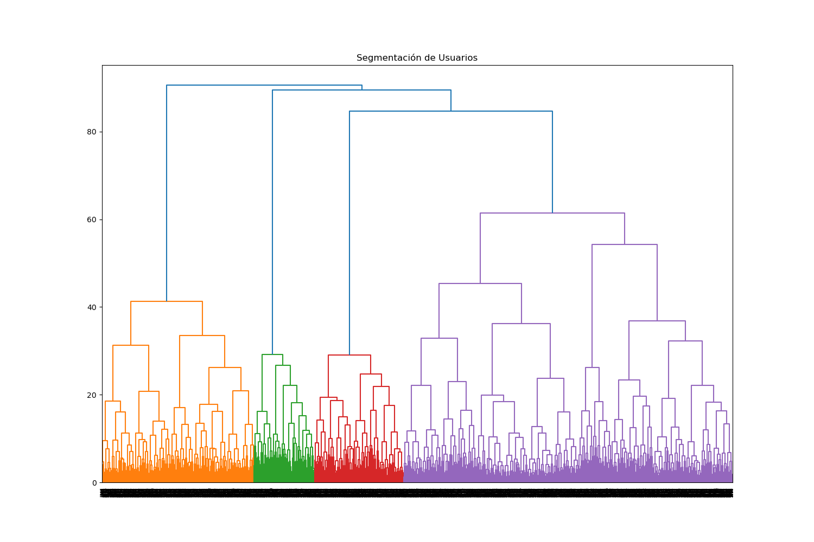
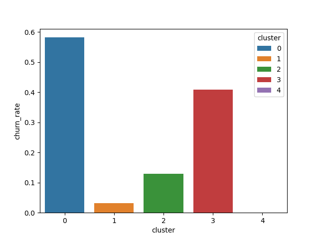
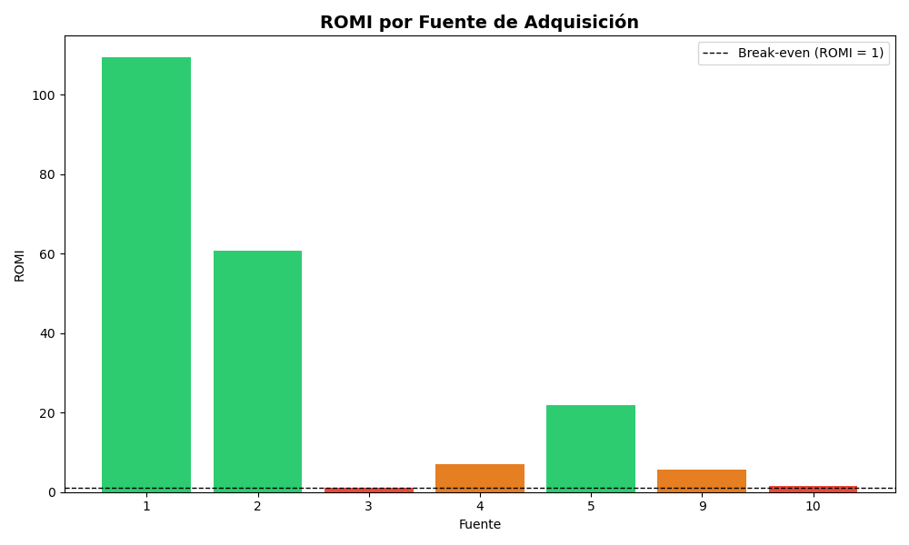
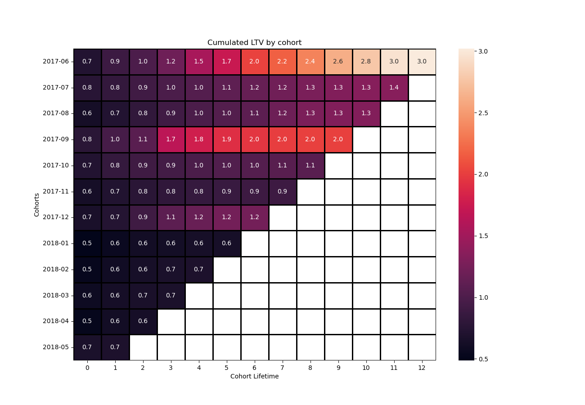
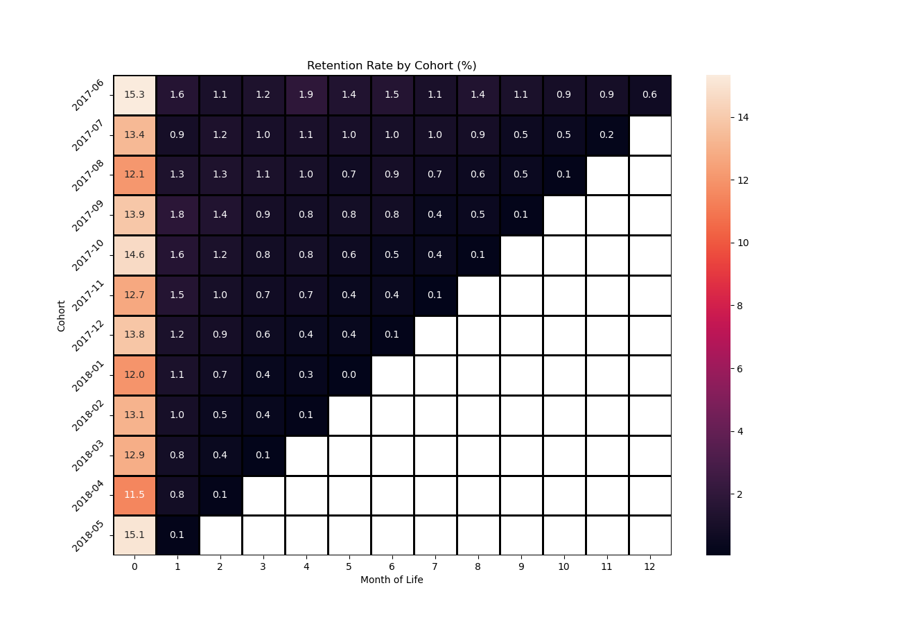

  

# Sebastián Oropeza — Data Analyst
Data Analyst con formación en TripleTen y proyectos aplicados en machine 
learning, marketing analytics y A/B testing. Trabajo con Python, SQL y 
Tableau para limpiar, estructurar y visualizar datos que respalden 
decisiones de negocio.

He desarrollado un modelo predictivo de churn con 90% de accuracy sobre 
4,000 clientes, identificado una ineficiencia de $141,321 en campañas de 
marketing y auditado pruebas A/B detectando problemas de ejecución que 
invalidaban sus conclusiones.

Inglés C1 (EFSET) — disponible para roles remotos, híbridos y presenciales.

---

### Habilidades técnicas

**Lenguajes:**

**Visualización:**

**Análisis:**

**Otros:**

---

### Contacto

***

# Proyectos seleccionados

## Predicción de Churn en Gimnasios — Model Fitness
Model Fitness pierde clientes silenciosamente: se van sin cancelar, 
simplemente dejan de asistir. El gimnasio necesita identificar quién 
está en riesgo antes de que desaparezca, y diseñar intervenciones 
específicas para cada perfil de cliente.

### Herramientas y tipo de proyecto

## Preguntas clave:
1. ¿Qué variables predicen mejor la cancelación de una membresía?
2. ¿Cuándo ocurre la deserción y qué la desencadena?
3. ¿Qué perfiles de cliente existen y cuál es su nivel de riesgo?
4. ¿Qué estrategias concretas pueden reducir el churn por segmento?

## Metodología
- **Análisis exploratorio:** Identificación de variables con mayor poder 
  predictivo y detección de multicolinealidad crítica entre pares de 
  variables (correlaciones de 0.95 y 0.97).
- **Modelado predictivo:** Entrenamiento y comparación de Regresión 
  Logística y Random Forest sobre dataset de 4,000 clientes. Selección 
  del modelo final basada en Recall como métrica prioritaria.
- **Segmentación:** Clustering con K-Means validado con dendrograma 
  jerárquico para determinar número óptimo de clústeres (5).
- **Recomendaciones:** Traducción de hallazgos en estrategias de retención 
  diferenciadas por segmento.

## Insights clave:
1. **El primer mes es la ventana crítica.** El tiempo de vida promedio 
de un cliente que cancela es de 0.99 meses — se van en su primera 
experiencia. Quienes superan el tercer mes muestran lealtad prolongada.

2. **La asistencia semanal es la señal de alerta más temprana.** Los 
usuarios en riesgo reducen su frecuencia a 1 visita o menos por semana 
en el mes de cancelación. Una asistencia de 3 o más veces por semana 
reduce la probabilidad de abandono a casi cero.

3. **Los contratos cortos son volátiles por naturaleza.** Los clientes 
que cancelan promedian contratos de 1.7 meses; los leales, 5.7 meses.

4. **Los vínculos sociales y corporativos retienen más que cualquier 
descuento.** Solo el 18.3% de los clientes que se van llegó referido 
por un amigo, contra el 35.3% de los leales.

5. **La Regresión Logística superó al Random Forest como modelo final.**

   | Métrica | Regresión Logística | Random Forest |
   |---|---|---|
   | Accuracy | 90.0% | 89.6% |
   | Recall | 81.8% | 75.2% |
   | Precisión | 78.6% | 81.4% |

6. **Cinco segmentos identificados con tasas de churn desde 0% hasta 58.2%.**

   | Clúster | Perfil | Churn |
   |---|---|---|
   | 0 — Golondrina | Contratos cortos, sin vínculos, perfil joven | 58.2% |
   | 3 — Foráneos | Viven lejos del gimnasio | 40.8% |
   | 2 — Red Social | 100% referidos o convenio corporativo | 12.9% |
   | 1 — Premium | Contratos largos, alto consumo adicional | 3.2% |
   | 4 — VIP | Clientes históricos, hábito consolidado | 0.0% |

## Recomendaciones:
1. **Programa de onboarding para primeros 60 días** — sesión gratuita 
con entrenador en la primera semana y alerta automática si la asistencia 
cae por debajo de 2 visitas en la primera quincena.
2. **Campaña de conversión a contratos largos** — descuento para usuarios 
mensuales que completen su primer mes, incentivando el salto a membresías 
semestrales o anuales.
3. **Club de recompensas por asistencia** — puntos canjeables en cafetería 
y tienda para premiar consistencia y usar servicios adicionales como ancla 
de hábito diario.
4. **Expansión del canal corporativo y social** — nuevos convenios con 
empresas del vecindario y optimización del programa "Trae a un amigo".

### Visualizaciones destacadas

1. **Mapa de calor de correlaciones entre variables**

El análisis del mapa de calor revela que la gran mayoría de las características no presentan correlaciones significativas entre sí. Sin embargo, se detectan dos casos críticos de multicolinealidad fuerte (valores superiores a **0.90**):

- `contract_period` y `month_to_end_contract` (**0.97**): Relación lineal casi perfecta debido a la naturaleza del vencimiento de las membresías.
- `avg_class_frequency_total` y `avg_class_frequency_current_month` (**0.95**): Alta dependencia entre el comportamiento histórico de asistencia y el del mes en curso.

Para evitar distorsiones en los coeficientes del modelo de Regresión Logística, se recomienda eliminar una variable de cada par (`month_to_end_contract` y `avg_class_frequency_total`) antes de proceder con el entrenamiento de los modelos predictivos.

2. **Dendrograma jerárquico**

El gráfico jerárquico muestra una estructura de agrupamiento clara:

- **Grupos Principales**: Se identifican inicialmente 4 grandes bloques de color en la base (naranja, verde, rojo y morado).

- **Justificación de los 5 Clústeres**: Al analizar la rama morada de la derecha, se observa una división sumamente marcada en dos sub-ramas principales alrededor de la altura 60. Separar este bloque masivo en dos subgrupos independientes nos permite obtener una segmentación más precisa y detallada. Por lo tanto, se justifica matemáticamente fijar el algoritmo en **5 clústeres** para el análisis posterior con K-Means.

3. **Tasa de churn por clúster**

Al ejecutar el aislamiento de la tasa de deserción por grupo, se obtienen las siguientes respuestas clave para el negocio:

1. **¿Difieren en términos de tasa de cancelación?** Sí, difieren de manera drástica y polarizada. La base de clientes de Model Fitness se divide en dos extremos muy claros: grupos con una retención casi perfecta y grupos con una fuga masiva de usuarios.

2. **¿Qué grupos son propensos a irse?**
- **Clúster 0 (Riesgo Crítico):** Presenta la tasa de cancelación más alta del gimnasio con un **58.2%**. Es el grupo prioritario a intervenir.
- **Clúster 3 (Riesgo Moderado-Alto):** Registra una tasa de deserción del **40.8%**, impulsada principalmente por la barrera geográfica (usuarios lejanos).

3. **¿Cuáles son leales?**
- **Clúster 4 (Lealtad Absoluta):** Muestra una tasa de cancelación del **0.0%**. Son los clientes históricos más consolidados del club.
- **Clúster 1 (Alta Lealtad):** Registra apenas un **3.2%** de deserción, caracterizado por su alto consumo en servicios adicionales y contratos de largo plazo.
- **Clúster 2 (Alta Lealtad Social):** Presenta un **12.9%** de bajas, respaldado por la efectividad de las membresías corporativas y el programa de referidos.

**Visita el [repositorio completo](https://github.com/sgcuervo/model-fitness-machine-learning) para más detalles.**

---

## Análisis de Marketing y Comportamiento de Usuarios — Showz
Showz invierte $329,131 en marketing pero no sabe qué canales realmente 
funcionan. El canal que consume el 42.9% del presupuesto genera el ROMI 
más bajo del período, mientras el más rentable recibe una fracción mínima 
de inversión. Este análisis identifica dónde está el dinero mal asignado 
y qué hacer al respecto.

### Herramientas y tipo de proyecto

## Preguntas clave:
1. ¿Cómo interactúan los usuarios con la plataforma y cuánto tiempo 
   tardan en convertir?
2. ¿Cuándo y cuánto compran — existe estacionalidad relevante?
3. ¿Qué canales de marketing generan mayor retorno sobre la inversión?
4. ¿Qué cohortes de usuarios generan mayor valor de vida (LTV)?

## Metodología
- **Preparación de datos:** Se eliminaron sesiones mayores a 30 minutos 
  (7.76% del total) por representar navegadores abandonados. Se usó la 
  mediana como métrica central en distribuciones con sesgo positivo.
- **Análisis de comportamiento:** Estudio del embudo de conversión, 
  frecuencia de sesiones y tiempo hasta primera compra.
- **Análisis de cohortes:** Seguimiento del LTV y retención por grupo 
  de usuarios a lo largo del tiempo.
- **Métricas de marketing:** Cálculo de CAC, ROMI y LTV por fuente de 
  adquisición para evaluar eficiencia del presupuesto.

**Nota:** El dataset no cubre el período completo — los primeros y últimos 
meses pueden mostrar valores atípicos por datos parciales.

## Insights clave:
1. **El usuario de Showz llega con intención de compra.** El 67.9% 
convierte el mismo día de su primera visita. La media de 17.42 días 
revela un segmento que tarda más — oportunidad directa para retargeting.

2. **La tasa de conversión del 14.62% supera 4x al ecommerce general 
(1-4%).** Pero más visitas no garantizan más conversiones: noviembre 2017 
fue el mes de mayor actividad y no coincidió con el pico de conversión.

3. **La estacionalidad navideña es predecible y aprovechable.** Diciembre 
2017 registró el pico de ventas y la cohorte de septiembre 2017 mostró 
un salto notable en su tercer mes — exactamente diciembre.

4. **La retención cae drásticamente después del primer mes.** De 13-15% 
en el mes 0 a menos del 2% en meses siguientes. Showz opera con una base 
principalmente transaccional.

5. **El hallazgo más crítico: la fuente 3 es la más cara y la menos 
rentable.**

   | Fuente | Inversión | CAC | ROMI |
   |---|---|---|---|
   | Fuente 3 | $141,321 (42.9%) | 10.21 | 1.10 |
   | Fuente 1 | $20,833 | 2.92 | 109.31 |
   | Fuente 9 | Reducida | 1.98 | 5.59 |
   | Fuente 7 | Con costos | — | 0 compradores |

   *La fuente 1 genera 99x más retorno que la fuente 3 con una fracción 
   del presupuesto.*

## Recomendaciones estratégicas:
1. **Reasignar presupuesto de fuente 3 hacia fuente 1** — mayor impacto 
inmediato en rentabilidad sin incrementar gasto total.
2. **Investigar fuentes 6 y 7** — la fuente 7 registra costos sin 
compradores asociados.
3. **Incrementar inversión en fuente 9** — mejor rendimiento que fuentes 
con presupuesto similar.
4. **Concentrar inversión entre septiembre y diciembre** para aprovechar 
la estacionalidad identificada.
5. **Diseñar campaña de retargeting para el 32.1% que no convierte el 
primer día** — intención demostrada, necesita un empujón adicional.

### Visualizaciones destacadas

1. **Gráfico de ROMI por fuente de adquisición**

La fuente 3 presenta el ROMI más bajo (1.10) a pesar de concentrar el 42.9% del presupuesto total (**$141,321**). Esta disparidad es crítica: la fuente con mayor inversión es la menos rentable, lo que no justifica su nivel de gasto actual.

La fuente 1, con una inversión considerablemente menor (**$20,833**), genera el ROMI más alto del período (109.31), lo que la convierte en la fuente más eficiente. Se recomienda redirigir gradualmente parte del presupuesto de la fuente 3 hacia la fuente 1.

La fuente 9, aunque con presupuesto reducido, muestra mejor rendimiento que la fuente 10 con inversión similar (ROMI 5.59 vs 1.51). Incrementar gradualmente su presupuesto y analizar el perfil de sus usuarios podría revelar oportunidades de crecimiento.

2. **Mapa de calor de LTV por cohorte y mes de vida**

Las cohortes de 2017 presentan un LTV mayor al de las cohortes de 2018, lo cual es esperado dado su mayor tiempo de vida en la plataforma. Destacan dos cohortes: junio 2017 por su crecimiento sostenido a lo largo del tiempo, y septiembre 2017 por un salto notable en su tercer mes de vida, que corresponde a diciembre, consistente con la estacionalidad navideña identificada anteriormente.

Se observan períodos de estancamiento en varias cohortes, donde el LTV acumulado deja de crecer, indicando que los usuarios dejaron de comprar. Identificar en qué mes ocurre este estancamiento para cada cohorte podría ayudar al equipo de marketing a diseñar campañas de reactivación dirigidas justo antes de ese punto.

3. **Gráfico de retención por cohorte**

La tasa de retención cae drásticamente después del primer mes, pasando de ~13-15% en el mes 0 a menos del 2% en los meses siguientes para todas las cohortes. Esto confirma que Showz tiene una base de usuarios principalmente transaccional, donde la mayoría compra una sola vez. El equipo de marketing debería explorar estrategias de retención como campañas de reactivación y programas de fidelización para incrementar las compras recurrentes

**Visita el [repositorio completo](https://github.com/sgcuervo/showz-marketing-analysis) para más detalles.**

